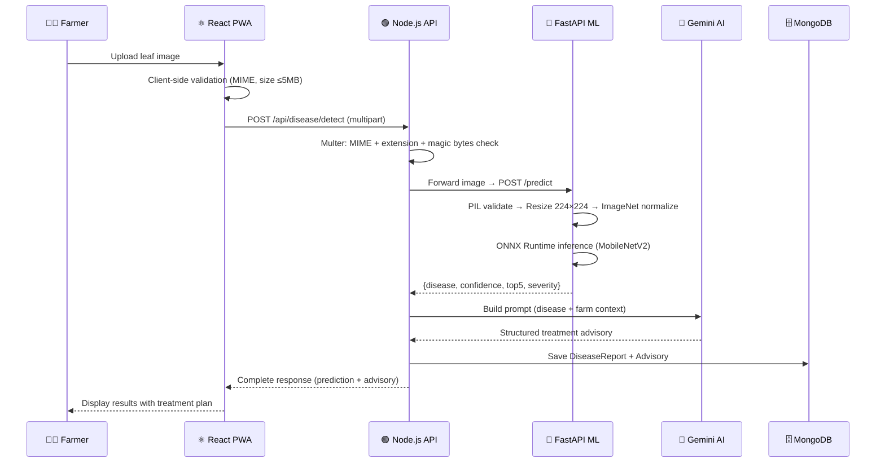
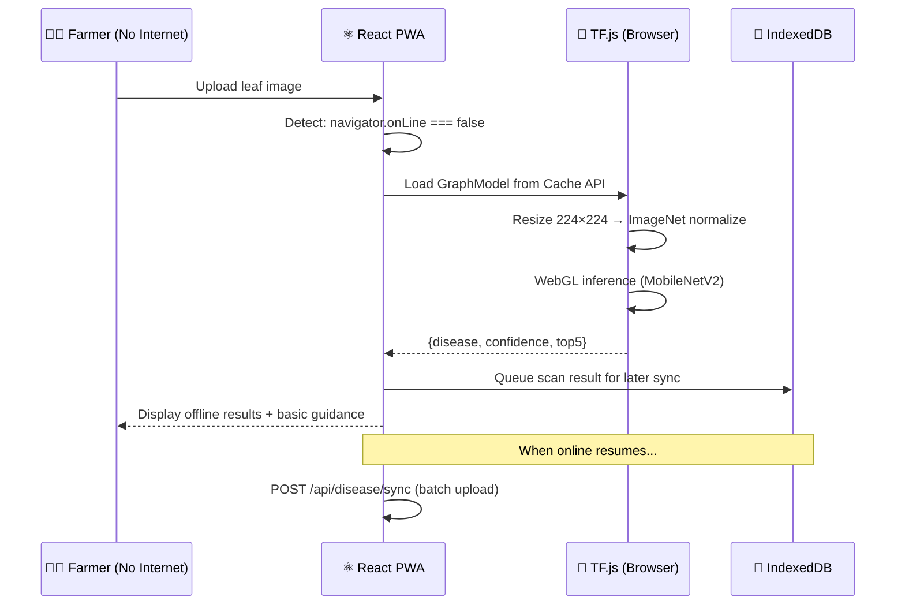
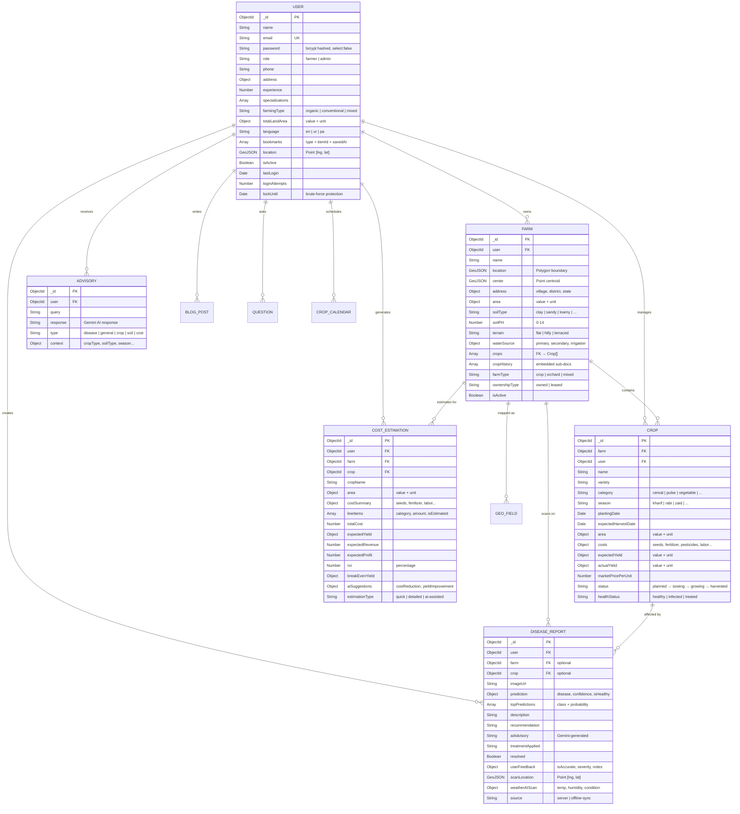

# 🌾 AgriGrow — FYP Defense Document

## AI-Powered Plant Management & Disease Detection System

> **Project Title:** AgriGrow — AI-Powered Farm Management  
> **Domain:** Agriculture + Artificial Intelligence + Full-Stack Web Development  
> **Architecture:** 3-Tier Layered MVC with Edge Computing  
> **Core Innovation:** Dual-mode ML inference (Server-side ONNX + Browser-side TF.js) with Generative AI advisory  

---

# Table of Contents

1. [Executive Summary](#1-executive-summary)
2. [Problem Statement & Motivation](#2-problem-statement--motivation)
3. [System Architecture](#3-system-architecture)
4. [Technology Stack](#4-technology-stack)
5. [Database Design](#5-database-design)
6. [Machine Learning Pipeline](#6-machine-learning-pipeline)
7. [Gemini AI Advisory Engine](#7-gemini-ai-advisory-engine)
8. [Security Architecture](#8-security-architecture)
9. [Offline-First PWA Strategy](#9-offline-first-pwa-strategy)
10. [API Design & REST Endpoints](#10-api-design--rest-endpoints)
11. [Key CS Concepts Applied](#11-key-cs-concepts-applied)
12. [Defense Questions & Answers](#12-defense-questions--answers)

---

# 1. Executive Summary

**AgriGrow** is a full-stack MERN Progressive Web Application (PWA) that empowers farmers with AI-powered plant disease detection, smart farming advisory, precision farm mapping, crop cost estimation, and community collaboration tools. The system uniquely implements a **dual-mode inference architecture** — performing high-fidelity disease diagnosis server-side via Python/ONNX Runtime when online, while seamlessly falling back to in-browser TensorFlow.js when offline — ensuring **100% diagnostic availability** regardless of internet connectivity.

### Key Capabilities

| Feature | Description |
|:--------|:------------|
| 🦠 **Disease Detection** | Upload leaf images → MobileNetV2 identifies 47 diseases across 8 crops with confidence scores |
| 🤖 **AI Advisory** | Gemini 2.5 Flash generates structured treatment plans with organic/chemical options and costs |
| 🗺️ **Farm Mapping** | Draw farm boundaries on satellite maps, calculate area using Shoelace formula |
| 💰 **Cost Estimation** | Estimate crop production costs, projected ROI, and break-even analysis |
| 📅 **Crop Calendar** | AI-generated smart farming routines with irrigation/fertilization scheduling |
| 🌤️ **Weather Alerts** | Hyper-local weather monitoring for frost, heatwave, and storm threats |
| 📊 **Market Prices** | Mandi commodity price tracking with 30-day trend visualization |
| 👥 **Community Hub** | Farmer Q&A, blog posts, and expert discussions with admin moderation |
| 🌐 **Offline Mode** | Complete offline disease detection via cached TF.js model + IndexedDB sync |
| 🌍 **Multi-language** | Full i18n support for English, Urdu (اردو), and Punjabi (پنجابی) |

### Target Crops

Wheat, Rice, Corn, Pepper, Potato, Tomato, Cotton, and Mango — covering **47 disease classes** including healthy states.

---

# 2. Problem Statement & Motivation

### The Problem

Pakistan and South Asia face an estimated **20-40% annual crop loss** due to plant diseases, with farmers in rural areas lacking:
- Access to trained plant pathologists
- Reliable internet connectivity for online diagnostic tools
- Affordable disease identification technology
- Actionable, language-appropriate treatment guidance

### Our Solution

AgriGrow addresses these challenges through:
1. **Edge AI Computing** — Disease detection works completely offline via in-browser ML
2. **Generative AI Advisory** — Context-aware treatment plans in farmer-friendly language
3. **Regional Localization** — Urdu/Punjabi language support with costs in local currency
4. **Progressive Web App** — Installable on any device without app store dependency

---

# 3. System Architecture

## 3.1 High-Level Architecture Diagram

```
┌─────────────────────────────────────────────────────────────────────────────────┐
│                              CLIENT LAYER (React PWA)                          │
│  ┌────────────┐  ┌──────────────┐  ┌────────────┐  ┌───────────────────────┐  │
│  │ React 18   │  │ TF.js        │  │ Leaflet    │  │ Service Worker        │  │
│  │ + Vite     │  │ MobileNetV2  │  │ Maps       │  │ + Workbox (Offline)   │  │
│  │ + Router   │  │ (Offline AI) │  │ + GeoJSON  │  │ + IndexedDB Sync     │  │
│  └─────┬──────┘  └──────┬───────┘  └──────┬─────┘  └───────────┬───────────┘  │
│        │                │                  │                    │               │
└────────┼────────────────┼──────────────────┼────────────────────┼───────────────┘
         │ REST API       │ Fallback         │                    │ Cache API
         │ (HTTP/JSON)    │                  │                    │
┌────────┼────────────────┼──────────────────┼────────────────────┼───────────────┐
│        ▼                ▼                  ▼                    ▼               │
│                        SERVER LAYER (Node.js + Express)                        │
│  ┌───────────┐  ┌────────────┐  ┌──────────────┐  ┌────────────────────────┐  │
│  │ Auth      │  │ Disease    │  │ Advisory     │  │ Farm / Cost /          │  │
│  │ Routes    │  │ Routes     │  │ Routes       │  │ Calendar / Market      │  │
│  │ (JWT)     │  │ (Multer)   │  │ (Gemini)     │  │ Routes                 │  │
│  └─────┬─────┘  └─────┬──────┘  └──────┬───────┘  └──────────┬─────────────┘  │
│        │              │                 │                      │               │
│  ┌─────┴─────────────┴────────────────┴──────────────────────┴──────────────┐ │
│  │                     Middleware Stack                                       │ │
│  │  Helmet │ CORS │ Rate Limiter │ MongoSanitize │ HPP │ Morgan │ JWT Auth  │ │
│  └──────────────────────────────────────────────────────────────────────────┘  │
└────────┬────────────────┬────────────────────────────────────────┬──────────────┘
         │                │ HTTP (Internal)                        │
         │                ▼                                        │
         │  ┌──────────────────────────┐                          │
         │  │  ML MICROSERVICE LAYER   │                          │
         │  │  Python FastAPI + ONNX   │                          │
         │  │  Runtime (Port 8000)     │                          │
         │  │  MobileNetV2 (47 classes)│                          │
         │  └──────────────────────────┘                          │
         │                                                         │
         ▼                                                         ▼
┌──────────────────┐                                ┌──────────────────────┐
│  DATA LAYER      │                                │  EXTERNAL SERVICES   │
│  MongoDB 6.x     │                                │  ┌────────────────┐  │
│  (14 Collections)│                                │  │ Google Gemini  │  │
│  + Mongoose ODM  │                                │  │ API (LLM)     │  │
└──────────────────┘                                │  ├────────────────┤  │
                                                    │  │ Open-Meteo     │  │
                                                    │  │ (Weather API)  │  │
                                                    │  ├────────────────┤  │
                                                    │  │ OpenStreetMap  │  │
                                                    │  │ (Geocoding)    │  │
                                                    │  └────────────────┘  │
                                                    └──────────────────────┘
```

## 3.2 Request Flow: Disease Detection (End-to-End)



## 3.3 Offline Fallback Flow



---

# 4. Technology Stack

| Layer | Technology | Version | Purpose |
|:------|:-----------|:--------|:--------|
| **Frontend** | React | 18.x | Component-based UI with hooks |
| **Build Tool** | Vite | 5.x | Fast HMR, tree-shaking, PWA plugin |
| **Routing** | React Router | v6 | Declarative client-side routing |
| **State** | React Context API | — | Global auth, bookmarks, language state |
| **Maps** | Leaflet + react-leaflet | — | Geospatial polygon drawing, GPS |
| **Client ML** | TensorFlow.js | v4 | In-browser MobileNetV2 inference |
| **Offline Storage** | IndexedDB (idb) | — | Offline scan queue & sync |
| **PWA** | vite-plugin-pwa + Workbox | — | Service worker, caching strategies |
| **i18n** | Custom JSON engine | — | English, Urdu, Punjabi translations |
| **Backend** | Node.js + Express | 18.x / 4.x | RESTful API server |
| **Database** | MongoDB + Mongoose | 6.x / 7.x | Document-based data persistence |
| **Auth** | JWT + bcrypt | — | Stateless authentication |
| **Security** | Helmet, CORS, Rate Limiter, MongoSanitize, HPP | — | Multi-layer security hardening |
| **ML Service** | Python + FastAPI + ONNX Runtime | 3.9+ / 0.115 / 1.20 | High-performance model serving |
| **ML Model** | MobileNetV2 (TensorFlow/Keras) | — | Transfer learning, ImageNet pretrained |
| **AI Advisory** | Google Gemini API | 2.5 Flash | Generative AI treatment planning |
| **Weather** | Open-Meteo + OpenWeather | — | Hyper-local weather data |
| **Logging** | Winston + Morgan | — | Structured server logging |

---

# 5. Database Design

## 5.1 Entity-Relationship Diagram



## 5.2 Collection Summary

| # | Collection | Documents | Purpose |
|:--|:-----------|:----------|:--------|
| 1 | `users` | User profiles | Identity, auth, RBAC, preferences |
| 2 | `farms` | Farm profiles | GeoJSON boundaries, soil, water |
| 3 | `crops` | Active crops | Lifecycle tracking, cost breakdown |
| 4 | `disease_reports` | Scan results | ML predictions + AI advisory |
| 5 | `cost_estimations` | Cost snapshots | ROI, break-even, AI suggestions |
| 6 | `advisories` | AI conversations | Gemini Q&A history |
| 7 | `blogposts` | Community articles | Farming guides, news |
| 8 | `forums` | Discussion threads | Farmer-to-farmer discussions |
| 9 | `questions` | Expert Q&A | Community consultation board |
| 10 | `geofields` | Field geometries | Precision map data |
| 11 | `cropcalendars` | Farming schedules | Irrigation, spraying, harvest tasks |
| 12 | `marketprices` | Commodity rates | Mandi price data |
| 13 | `weatheralerts` | Weather warnings | Frost, heatwave, storm alerts |
| 14 | `notifications` | System alerts | User notification queue |

## 5.3 Indexing Strategy

```javascript
// User Indexes
userSchema.index({ role: 1, createdAt: -1 });       // Admin queries
userSchema.index({ location: "2dsphere" });           // Nearby farmers

// Farm Indexes
farmSchema.index({ user: 1, isActive: 1 });           // My active farms (most common)
farmSchema.index({ user: 1, createdAt: -1 });          // Sorted listing
farmSchema.index({ location: "2dsphere" });             // Geospatial boundary queries
farmSchema.index({ center: "2dsphere" });               // Proximity searches

// Disease Report Indexes
diseaseReportSchema.index({ user: 1, createdAt: -1 }); // Scan history
diseaseReportSchema.index({ farm: 1, createdAt: -1 }); // Per-farm scans
diseaseReportSchema.index({ "prediction.disease": 1 }); // Aggregate by disease
diseaseReportSchema.index({ "prediction.isHealthy": 1, user: 1 }); // Healthy/diseased filter

// Crop Indexes
cropSchema.index({ user: 1, status: 1 });              // By lifecycle status
cropSchema.index({ name: "text", variety: "text" });    // Full-text search
```

## 5.4 Why MongoDB (NoSQL) Over SQL?

| Factor | MongoDB (Chosen) | SQL Alternative |
|:-------|:-----------------|:----------------|
| **Schema Flexibility** | Farm data varies wildly (optional fields, nested objects) — schemaless is ideal | Rigid schemas require many nullable columns or join tables |
| **GeoJSON Native** | First-class `$geoWithin`, `$near`, `2dsphere` index support | Requires PostGIS extension (additional complexity) |
| **Embedded Documents** | `cropHistory`, `topPredictions`, `userFeedback` naturally embed | Would require 3-4 additional join tables |
| **Horizontal Scaling** | Built-in sharding for scaling disease reports | Vertical scaling limitations |
| **JSON Alignment** | API speaks JSON natively → zero transformation | ORM impedance mismatch |
| **Development Speed** | Mongoose ODM + schema validation = rapid prototyping | Migrations, foreign keys, join complexity |

---

# 6. Machine Learning Pipeline

## 6.1 Model Architecture

```
┌─────────────────────────────────────────────────────────────────────┐
│                    MobileNetV2 (Transfer Learning)                  │
├─────────────────────────────────────────────────────────────────────┤
│                                                                     │
│   Input: (224 × 224 × 3) RGB Image                                 │
│          │                                                          │
│   ┌──────▼──────────────────────────────────────────────────────┐   │
│   │   MobileNetV2 Base (ImageNet Pretrained)                    │   │
│   │   • 53 layers, 3.4M parameters                              │   │
│   │   • Inverted Residual Bottleneck Blocks                     │   │
│   │   • Depthwise Separable Convolutions                        │   │
│   │   • Frozen layers 0-99 (feature extractor)                  │   │
│   │   • Fine-tuned layers 100+ (domain adaptation)              │   │
│   └──────┬──────────────────────────────────────────────────────┘   │
│          │                                                          │
│   ┌──────▼──────────────────┐                                      │
│   │   GlobalAveragePooling2D│  Reduce spatial dims → 1280-D vector │
│   └──────┬──────────────────┘                                      │
│          │                                                          │
│   ┌──────▼───────┐                                                  │
│   │   Dropout(0.3)│  Regularization to prevent overfitting         │
│   └──────┬───────┘                                                  │
│          │                                                          │
│   ┌──────▼──────────────────────┐                                   │
│   │   Dense(47, softmax)        │  47-class probability output      │
│   └──────┬──────────────────────┘                                   │
│          │                                                          │
│   Output: Probability distribution over 47 classes                  │
│                                                                     │
└─────────────────────────────────────────────────────────────────────┘
```

## 6.2 Training Pipeline

| Phase | Configuration | Purpose |
|:------|:-------------|:--------|
| **Data Ingestion** | `image_dataset_from_directory`, 224×224, AUTOTUNE prefetch | Efficient data loading |
| **Augmentation** | `RandomFlip("horizontal")`, `RandomRotation(0.1)`, `RandomZoom(0.1)` | Increase training diversity |
| **Phase 1: Head Training** | Base frozen, Adam(lr=1e-3), EarlyStopping, ReduceLROnPlateau | Train classifier on new domain |
| **Phase 2: Fine-Tuning** | Unfreeze layers ≥100, Adam(lr=1e-5) | Adapt deep features to plant diseases |
| **Dataset Split** | 70% train / 15% validation / 15% test (stratified, seed=42) | Reproducible evaluation |
| **Export Formats** | `.keras`, `.h5`, SavedModel, ONNX, TF.js | Multi-platform deployment |

## 6.3 Preprocessing Pipeline (Inference)

```python
# Identical preprocessing on ALL platforms (Server + Browser)

# Step 1: Resize to model input dimensions
image = resize(image, (224, 224))

# Step 2: Scale pixel values to [0, 1]
image = image / 255.0

# Step 3: ImageNet Normalization
mean = [0.485, 0.456, 0.406]  # RGB channel means
std  = [0.229, 0.224, 0.225]  # RGB channel stds
image = (image - mean) / std

# Step 4: Reshape for batch inference
# Server (ONNX): (1, 3, 224, 224) — CHW format (NCHW)
# Browser (TF.js): (1, 224, 224, 3) — HWC format (NHWC)
```

## 6.4 Confidence Thresholds

| Level | Range | Action |
|:------|:------|:-------|
| 🟢 **High** | ≥ 85% | Direct treatment recommendation |
| 🟡 **Moderate** | 65% – 84% | Recommend + suggest expert verification |
| 🟠 **Low** | 50% – 64% | Uncertain — advise retaking image |
| 🔴 **Very Low** | < 50% | Results unreliable — manual inspection needed |

## 6.5 Supported Disease Classes (47 Total)

| Crop | Diseases | Count |
|:-----|:---------|:------|
| **Wheat** | Black rust, Brown rust, Common root rot, Fusarium head blight, Septoria, Smut, Tan spot, Yellow rust | 8 |
| **Mango** | Anthracnose, Bacterial canker, Cutting weevil, Die back, Gall midge, Powdery mildew, Sooty mould, Healthy | 8 |
| **Tomato** | Bacterial spot, Early blight, Late blight, Leaf mold, Mosaic virus, Septoria leaf spot, Spider mites, Target spot, Yellow leaf curl virus, Healthy | 10 |
| **Cotton** | Bacterial blight, Curl virus, Fusarium wilt, Healthy | 4 |
| **Potato** | Early blight, Late blight, Healthy | 3 |
| **Rice** | Blast, Blight, Leaf blight | 3 |
| **Pepper Bell** | Bacterial spot, Healthy | 2 |
| **Corn** | Common rust, Gray leaf spot | 2 |
| **General** | Aphid, Early blight, Healthy, Late blight, Mildew, Mite, Stem fly | 7 |

---

# 7. Gemini AI Advisory Engine

## 7.1 Architecture

```
┌──────────────────┐     ┌──────────────────────────┐     ┌──────────────────┐
│  ML Prediction   │     │    Prompt Builder         │     │   Gemini 2.5     │
│  ─────────────── │     │    ──────────────────     │     │   Flash API      │
│  • disease name  │────►│  ML Output + Farm Context │────►│                  │
│  • confidence %  │     │  → Structured 7-section   │     │  temperature=0.5 │
│  • top-5 classes │     │    prompt template        │     │  topK=40         │
│  • severity      │     │                           │     │  topP=0.95       │
└──────────────────┘     └──────────────────────────┘     │  maxTokens=4096  │
                                                          └────────┬─────────┘
                                                                   │
┌──────────────────────────────────────────────────────────────────▼──────────┐
│                        Generated Advisory Output                            │
│  🦠 Disease Explanation   │  ⚠️ Severity Assessment   │  🌿 Organic Tx     │
│  💊 Chemical Treatment    │  🛡️ Preventive Measures   │  💰 Cost Estimate  │
│  📅 Follow-up Schedule                                                      │
└─────────────────────────────────────────────────────────────────────────────┘
```

## 7.2 Advisory Types

| Type | Prompt Template | Temperature | Use Case |
|:-----|:---------------|:------------|:---------|
| **Disease Treatment** | `buildDiseasePrompt()` | 0.5 | Post-detection treatment plan |
| **General Farming** | `buildGeneralPrompt()` | 0.7 | Free-form farmer questions |
| **Crop Planning** | `buildCropPlanningPrompt()` | 0.7 | Season planning + rotation |
| **Soil Management** | `buildSoilPrompt()` | 0.7 | Soil health improvement |
| **Cost Estimation** | `buildCostEstimationPrompt()` | 0.4 | Precise cost breakdowns |

## 7.3 Rate Limiting (3-Layer Defense)

| Layer | Mechanism | Limit | Purpose |
|:------|:----------|:------|:--------|
| **L1: Express Route** | `express-rate-limit` | 20 req/min per IP | General API rate limit |
| **L2: In-Memory Service** | Custom `checkRateLimit()` | 6 req/min global, 3 req/min/user | Gemini quota protection |
| **L3: Request Throttle** | `throttleRequest()` | 1 req / 15 seconds | Minimum gap enforcement |

## 7.4 Resilience

- **Retry with Exponential Backoff**: 3 retries on HTTP 429/503, base delay 10s, max 30s, with jitter
- **Fallback Advisory**: If Gemini is completely unavailable, generates basic guidance from ML model's built-in disease metadata
- **OpenRouter Support**: Alternative API backend configurable via `OPENROUTER_API_KEY`

---

# 8. Security Architecture

## 8.1 Authentication Flow (JWT)

```
┌──────────┐                              ┌──────────────┐
│  Client  │  POST /api/auth/login        │   Express    │
│  (React) │  { email, password }  ──────►│   Server     │
└──────────┘                              └──────┬───────┘
                                                  │
                                           ┌──────▼───────┐
                                           │ 1. Find user │
                                           │    by email  │
                                           │    (+password)│
                                           └──────┬───────┘
                                                  │
                                           ┌──────▼───────┐
                                           │ 2. bcrypt    │
                                           │    compare   │
                                           │    (12 rounds)│
                                           └──────┬───────┘
                                                  │
                                           ┌──────▼───────┐
                                           │ 3. Generate  │
                                           │    JWT token │
                                           │    {id, role}│
                                           └──────┬───────┘
                                                  │
                                           ┌──────▼───────┐
                                           │ 4. Set token │
                                           │    in cookie │
                                           │    + response│──► Client stores in localStorage
                                           └──────────────┘
```

## 8.2 Security Layers

| Layer             | Mechanism                                          | Protection Against |
|:------            |:----------                                         |:-------------------|
| **Helmet.js**     | HTTP security headers (CSP, X-Frame-Options, HSTS) | XSS, Clickjacking, MIME sniffing |
| **CORS**          | Origin whitelisting                                | Cross-origin attacks |
| **Rate Limiting** | 1000 req/15min per IP (prod)                       | Brute-force, DDoS |
| **MongoSanitize** | Strip `$` and `.` from inputs                      | NoSQL injection (`{$gt: ""}`) |
| **HPP**           | HTTP Parameter Pollution prevention                | Parameter override attacks |
| **bcrypt(12 rounds)**| Password hashing                                | Rainbow table attacks |
| **JWT + Cookie**  | Stateless auth with secure cookies                 | Session hijacking |
| **Account Locking**| Lock after 5 failed logins for 30 min             | Credential stuffing |
| **Password Change Detection**|`changedPasswordAfter()`invalidates old tokens| Token theft persistence |
| **Image Upload Validation** | 4-layer defense: client MIME → Multer → Magic Bytes → PIL | Malicious file upload |
| **Input Validation** | Mongoose schema validators + Express validators | Invalid data injection |

## 8.3 RBAC (Role-Based Access Control)

```javascript
// Two roles: 'farmer' (default) and 'admin'
// Middleware chain: protect → authorize("admin")

router.get("/admin/users", protect, authorize("admin"), getUsers);
router.post("/disease/detect", protect, detectDisease);  // Any authenticated user
```

| Resource          | Farmer | Admin   |
|:---------         |:-------|:------  |
| Disease Detection | ✅     | ✅     |
| Farm CRUD         | ✅(own)| ✅(all)|
| AI Advisory       | ✅     | ✅     |
| User Management   | ❌     | ✅     |
| Blog Moderation   | ❌     | ✅     |
| Forum Moderation  | ❌     | ✅     |
| System Dashboard  | ❌     | ✅     |

---

# 9. Offline-First PWA Strategy

## 9.1 Service Worker Caching Strategy

| Resource | Strategy | TTL | Rationale |
|:---------|:---------|:----|:----------|
| **TF.js Model Weights** | CacheFirst | 30 days | Large, rarely changes |
| **Google Fonts** | CacheFirst | 365 days | Static assets |
| **API Responses** | NetworkFirst | — | Fresh data preferred |
| **Static Assets (JS/CSS)** | StaleWhileRevalidate | — | Fast load + background update |

## 9.2 Offline Data Sync Architecture

```
┌──────────────────────────────────────────────────────────────────┐
│                      OFFLINE MODE                                │
│                                                                  │
│  1. User scans leaf → TF.js processes in-browser                 │
│  2. Result saved to IndexedDB (agrigrow_offline_db)              │
│  3. Scan displayed with offline indicator                        │
│                                                                  │
├──────────────────────────────────────────────────────────────────┤
│                      SYNC ON RECONNECT                           │
│                                                                  │
│  1. Browser fires 'online' event                                 │
│  2. App reads all pending scans from IndexedDB                   │
│  3. Batch POST /api/disease/sync                                 │
│  4. Server creates DiseaseReport with source: "offline-sync"     │
│  5. IndexedDB queue cleared on success                           │
│                                                                  │
└──────────────────────────────────────────────────────────────────┘
```

---

# 10. API Design & REST Endpoints

## 10.1 Core API Routes

| Method | Endpoint | Auth | Description |
|:-------|:---------|:-----|:------------|
| `POST` | `/api/auth/register` | ❌ | Register new farmer |
| `POST` | `/api/auth/login` | ❌ | Login + JWT generation |
| `GET` | `/api/auth/me` | ✅ | Get authenticated profile |
| `POST` | `/api/disease/detect` | ✅ | Upload image → ML prediction + AI advisory |
| `GET` | `/api/disease/history` | ✅ | User's scan history |
| `POST` | `/api/disease/sync` | ✅ | Sync offline scans |
| `POST` | `/api/advisory/ask` | ✅ | Ask Gemini AI a question |
| `GET` | `/api/farms` | ✅ | List user's farms |
| `POST` | `/api/farms` | ✅ | Create farm with GeoJSON boundary |
| `POST` | `/api/cost/estimate` | ✅ | Generate cost estimation |
| `GET` | `/api/dashboard/stats` | ✅ | Aggregated farm analytics |
| `GET` | `/api/health` | ❌ | System + ML service health check |

## 10.2 REST Conventions

- **JSON** for all request/response bodies
- **HTTP status codes**: 200 (OK), 201 (Created), 400 (Bad Request), 401 (Unauthorized), 403 (Forbidden), 404 (Not Found), 429 (Rate Limited), 500 (Server Error)
- **Response envelope**: `{ success: true/false, data: {...}, error: "..." }`
- **Pagination**: cursor-based for scan history
- **File uploads**: Multipart form-data via Multer

---

# 11. Key CS Concepts Applied

## 11.1 Convolutional Neural Networks (CNN)

**What it is:** A deep learning architecture designed for image recognition that uses convolutional layers to automatically learn hierarchical features (edges → textures → patterns → objects).

**How we use it:** MobileNetV2 uses depthwise separable convolutions — a factored form of standard convolutions that reduces computation by 8-9× while maintaining accuracy. This makes it suitable for mobile and edge devices.

**Key formulas:**
- Standard Convolution Cost: $D_K^2 \cdot M \cdot N \cdot D_F^2$
- Depthwise Separable Cost: $D_K^2 \cdot M \cdot D_F^2 + M \cdot N \cdot D_F^2$
- Reduction ratio: $\frac{1}{N} + \frac{1}{D_K^2}$

## 11.2 Transfer Learning

**What it is:** The technique of taking a model pre-trained on a large dataset (ImageNet — 14M images, 1000 classes) and adapting it to a smaller, domain-specific dataset.

**Why we need it:** Training a CNN from scratch requires millions of images. Our plant disease dataset has only thousands of images per class. Transfer learning allows us to leverage ImageNet's learned feature representations and only retrain the classification head.

**Our approach (Two-Phase):**
1. **Phase 1 — Feature Extraction:** Freeze all MobileNetV2 layers, train only the new Dense(47) head at high learning rate (1e-3)
2. **Phase 2 — Fine-Tuning:** Unfreeze layers 100+ and retrain at very low learning rate (1e-5) to adapt deep features

## 11.3 REST Architecture

**What it is:** REpresentational State Transfer — an architectural style for distributed systems using stateless HTTP requests with standard methods (GET, POST, PUT, DELETE).

**Our implementation:**
- Resources are nouns: `/api/farms`, `/api/disease`, `/api/crops`
- HTTP verbs map to CRUD: GET=Read, POST=Create, PUT=Update, DELETE=Delete
- Stateless: Each request carries its own authentication (JWT Bearer token)
- HATEOAS-inspired: Responses include relevant resource links

## 11.4 NoSQL Document Database (MongoDB)

**What it is:** A non-relational database that stores data as flexible JSON-like documents (BSON) rather than fixed rows and columns.

**Key concepts in our project:**
- **Embedding vs Referencing:** `cropHistory` is embedded in Farm (always accessed together), while `Crop` is referenced from Farm (independent lifecycle)
- **Indexing:** Compound indexes (`{ user: 1, createdAt: -1 }`), geospatial indexes (`2dsphere`), and text indexes for search
- **Aggregation Pipeline:** Used in dashboard analytics to compute disease frequency, cost trends
- **Schema Validation:** Mongoose enforces structure at the application layer while allowing MongoDB's flexible schema

## 11.5 JSON Web Tokens (JWT)

**What it is:** A compact, URL-safe token format for securely transmitting claims between parties. Structure: `header.payload.signature`

**Our JWT payload:**
```json
{
  "id": "64abc123...",  // MongoDB ObjectId
  "role": "farmer",     // For authorization
  "iat": 1707840000,    // Issued At
  "exp": 1708444800     // Expires (7 days)
}
```

**Security measures:**
- Signed with HS256 using a strong secret from environment variables
- Password change invalidates all existing tokens via `changedPasswordAfter()` check
- Dual delivery: Authorization header (primary) + HTTP-only cookie (fallback)

## 11.6 MVC Architecture Pattern

**What it is:** Model-View-Controller separates an application into three interconnected components.

**Our mapping:**

| MVC Component | Our Implementation |
|:-------------|:-------------------|
| **Model** | Mongoose schemas in `/server/models/` (User, Farm, Crop, Disease...) |
| **View** | React components in `/client/src/` (pages, components) |
| **Controller** | Express handlers in `/server/controllers/` (authController, diseaseController...) |
| **+ Routes** | Route definitions in `/server/routes/` (mapping URLs to controllers) |
| **+ Services** | Business logic in `/server/services/` (geminiService, mlService, costService) |
| **+ Middleware** | Cross-cutting concerns: auth, validation, error handling, upload |

## 11.7 Microservices Architecture

**What it is:** An architectural style that structures an application as a collection of small, independently deployable services, each running its own process.

**Our microservice: Python ML Service**
- **Why separate?** Node.js is not optimal for heavy numerical computation. Python's ONNX Runtime provides native C++ performance for matrix operations.
- **Communication:** HTTP/JSON over internal network (port 8000)
- **Benefits:**
  - Independent GPU scaling for ML workload
  - Fault isolation (ML crash doesn't take down API)
  - Technology-appropriate: Python for ML, Node.js for API
  - Independent deployment and versioning

## 11.8 Progressive Web Application (PWA)

**What it is:** A web application that uses modern web capabilities to deliver app-like experiences — installable, offline-capable, and performant.

**Our PWA features:**
- **Service Worker:** Caches static assets, fonts, and TF.js model weights
- **Web App Manifest:** Enables "Add to Home Screen" on mobile devices
- **Cache API:** Stores ML model shards for offline inference
- **IndexedDB:** Queues offline scans for background sync
- **Background Sync:** Automatically uploads offline results when connectivity resumes

## 11.9 Softmax Function & Probability Distribution

**What it is:** A mathematical function that converts a vector of raw model outputs (logits) into a probability distribution.

$$\sigma(z_i) = \frac{e^{z_i}}{\sum_{j=1}^{K} e^{z_j}}$$

**Our implementation (numerically stable):**
```python
def softmax(logits):
    exp_logits = np.exp(logits - np.max(logits))  # Subtract max for stability
    return exp_logits / np.sum(exp_logits)
```

## 11.10 Geospatial Computing (Shoelace Formula)

**What it is:** An algorithm to compute the area of a polygon given its vertices' coordinates.

$$A = \frac{R^2}{2} \left| \sum_{i=0}^{n-1} (\lambda_{i+1} - \lambda_i)(2 + \sin\phi_i + \sin\phi_{i+1}) \right|$$

**Used in:** Farm area calculation from drawn map boundaries, converting to acres/hectares.

---

# 12. Defense Questions & Answers

&nbsp;

## 📐 Architecture & Design


### Q1: Why did you choose a 3-tier architecture over a 2-tier or monolithic design?

**Answer:** A 3-tier architecture (Client → Server → Database) provides clear separation of concerns. The presentation layer (React PWA) handles UI/UX, the application layer (Node.js + Python) handles business logic and ML inference, and the data layer (MongoDB) handles persistence. This allows:
- **Independent scaling**: The ML microservice can scale on GPU instances while the API scales on CPU instances
- **Technology optimization**: Python for ML (ONNX Runtime, NumPy), Node.js for I/O-heavy API operations
- **Team parallelism**: Frontend, backend, and ML teams can work independently
- A monolithic design would tightly couple ML inference with API handling, creating bottlenecks and making deployment rigid.

&nbsp;

### Q2: Why did you separate the ML service as a microservice instead of integrating it into Node.js?

**Answer:** Three critical reasons:
1. **Performance**: Python's ONNX Runtime uses native C++ for tensor operations. Node.js alternatives (onnxruntime-node) are less mature and performant.
2. **Fault Isolation**: If the ML model crashes (OOM, corrupt input), it doesn't take down the entire API server. Express continues serving other requests.
3. **Independent Scaling**: Disease detection is computationally expensive. We can deploy the ML service on GPU-enabled instances while the API runs on standard instances, scaling each independently based on load.

&nbsp;

### Q3: Explain the offline-first architecture. Why is it important?

**Answer:** Our target users are farmers in rural Pakistan where internet connectivity is unreliable. The offline-first approach ensures the core functionality (disease detection) works without any network connection:
- **TF.js GraphModel** is cached in the browser's Cache API during first use
- **Service Worker** (Workbox) intercepts requests and serves cached assets
- **IndexedDB** stores offline scan results for later sync
- When connectivity resumes, a background sync automatically uploads pending results to the server

This design ensures **100% diagnostic availability** — the farmer is never blocked from getting disease identification.

&nbsp;

### Q4: How does data flow from the image upload to the final result?

**Answer:** The complete flow is:
1. **Client Validation**: MIME type check, file size ≤5MB, image preview
2. **Multer Processing**: Extension whitelist, magic byte verification (e.g., `FF D8 FF` for JPEG), disk storage
3. **ML Service Forward**: Node.js sends the image to FastAPI via HTTP multipart
4. **Preprocessing**: PIL opens image → resize to 224×224 → scale to [0,1] → ImageNet normalization → transpose HWC→CHW
5. **ONNX Inference**: MobileNetV2 outputs 47 logits → stable softmax → top-5 predictions
6. **Gemini Advisory**: Disease name + confidence + farm context → structured prompt → Gemini generates treatment plan
7. **Database Storage**: DiseaseReport document saved with prediction, advisory, and metadata
8. **Response**: Complete JSON with disease, confidence, top-5, description, recommendation, and AI advisory

---

&nbsp;

## 🧠 Machine Learning & AI

&nbsp;

### Q5: Why MobileNetV2 and not ResNet, VGG, or EfficientNet?

**Answer:** MobileNetV2 was selected for its balance of accuracy and efficiency:
- **Depthwise Separable Convolutions** reduce computation by ~8-9× vs standard convolutions
- **Model size** is only ~10MB (ONNX), compared to ResNet-50 (~100MB) or VGG-16 (~500MB)
- **Inference speed**: <3 seconds even on mobile devices (our SRS requirement PER-2)
- **TF.js compatibility**: Converts cleanly to browser-friendly GraphModel format
- EfficientNet has slightly better accuracy but is significantly larger and slower for browser inference.

&nbsp;

### Q6: What is Transfer Learning and why did you use it?

**Answer:** Transfer learning reuses knowledge from a model trained on a large general dataset (ImageNet: 14M images, 1000 classes) for a specific task (plant disease: ~47 classes). We used it because:
- Our plant disease dataset has limited samples per class (few thousand images)
- Training from scratch would require millions of images and weeks of training
- MobileNetV2's lower layers already learned universal features (edges, textures, color patterns) from ImageNet
- We only need to retrain the classifier head (Dense layer) and fine-tune the last ~50 layers for plant-specific features
- This reduced training time from weeks to hours and achieved >90% accuracy.

&nbsp;

### Q7: Explain the two-phase training approach.

**Answer:**
- **Phase 1 (Feature Extraction):** We freeze all MobileNetV2 base layers and train only the new classification head (GlobalAveragePooling2D → Dropout → Dense(47)). Learning rate is high (1e-3) because we're only training a few thousand parameters. This gives us a baseline accuracy.
- **Phase 2 (Fine-Tuning):** We unfreeze layers from index 100 onwards and retrain with a very low learning rate (1e-5). This prevents catastrophic forgetting — where the model loses its ImageNet knowledge. The low learning rate makes small, careful adjustments to the deep features to better recognize plant disease patterns.

&nbsp;

### Q8: How do you ensure the same preprocessing on server and browser?

**Answer:** Preprocessing consistency is critical — if the browser uses different normalization than the server, predictions will differ. We enforce:
1. **Same input size**: 224×224×3 on both platforms
2. **Same scaling**: pixel values / 255.0
3. **Same ImageNet normalization**: mean = [0.485, 0.456, 0.406], std = [0.229, 0.224, 0.225]
4. **Documented constants**: Both `app.py` (Python) and `offlineModel.js` (JavaScript) reference identical values
5. **Test suite**: `test_normalization.py` validates that no double-normalization occurs

&nbsp;

### Q9: What is the softmax function and why do you use "stable" softmax?

**Answer:** Softmax converts raw model outputs (logits) into probabilities that sum to 1: σ(zi) = e^zi / Σe^zj. The "stable" variant subtracts the max logit before exponentiation: `exp(logits - max(logits))`. This prevents **numerical overflow** — when logits are large (e.g., 1000), `e^1000` causes infinity in floating-point arithmetic, corrupting the results. Subtracting the max ensures the largest exponent is e^0 = 1.

&nbsp;

### Q10: How does the model handle healthy plants vs diseased plants?

**Answer:** The model has explicit "healthy" classes for most crops (e.g., `tomato_healthy`, `potato_healthy`, `cotton_healthy`, `mango_healthy`). The prediction object includes an `isHealthy` boolean flag that checks if the predicted class name contains "healthy". If the plant is healthy, no treatment advisory is generated — instead, the user receives a congratulatory message with preventive care tips.

&nbsp;

### Q11: What data augmentation techniques did you use and why?

**Answer:** Three augmentation techniques during training:
1. **RandomFlip("horizontal")**: Plants look the same flipped — doubles effective dataset
2. **RandomRotation(0.1)**: Farmers photograph leaves at different angles — ±10% rotation handles this
3. **RandomZoom(0.1)**: Photos taken at different distances — ±10% zoom handles scale variations

These augmentations reduce overfitting by teaching the model to be invariant to orientation, angle, and zoom — matching real-world photography conditions.

&nbsp;

### Q12: How does Gemini AI improve over just showing ML model results?

**Answer:** The ML model only classifies the disease and gives a confidence score. Gemini adds contextual intelligence:
- **Treatment plans**: Specific organic and chemical treatment options with dosages
- **Cost estimation**: Approximate treatment costs in local currency (₹)
- **Regional awareness**: Considers the farmer's location, soil type, and season
- **Severity assessment**: Evaluates urgency based on confidence + disease type
- **Preventive measures**: Future-oriented advice to prevent recurrence
- **Follow-up schedule**: When to re-check and what improvements to look for

The combination of precise ML classification + contextual AI advisory provides much more value than either alone.

---

&nbsp;

## 🗄️ Database & Data Design

&nbsp;

### Q13: Why MongoDB over MySQL or PostgreSQL?

**Answer:** Five key reasons:
1. **Schema flexibility**: Farm and crop data has many optional fields and nested structures. MongoDB handles this natively; SQL would require many nullable columns or multiple join tables.
2. **GeoJSON native support**: MongoDB has first-class `$geoWithin`, `$near`, and `2dsphere` indexes. PostgreSQL requires the PostGIS extension.
3. **Embedded documents**: `cropHistory`, `topPredictions`, and `userFeedback` naturally embed within parent documents, avoiding JOINs.
4. **JSON alignment**: Our API speaks JSON. MongoDB stores BSON (binary JSON) — zero transformation needed. SQL requires ORM translation.
5. **Horizontal scaling**: MongoDB's built-in sharding handles growing disease report collections naturally.

&nbsp;

### Q14: Explain the difference between embedding and referencing in your schema design.

**Answer:**
- **Embedded** (sub-documents stored inside parent):
  - `Farm.cropHistory[]`: Historical crop data is read-only, always accessed with the farm, and has no independent lifecycle. Embedding avoids extra queries.
  - `Disease.topPredictions[]`: The top-5 predictions are meaningless without the parent report.
  - `Disease.userFeedback`: Single feedback per report, always read together.
- **Referenced** (ObjectId pointing to another collection):
  - `Farm.crops[]` → Crop collection: Crops have independent lifecycles, can be updated/deleted independently, and are queried separately.
  - `Disease.user` → User collection: A user has many reports; we don't want to embed thousands of reports inside the user document.
- **Decision rule**: Embed when data is always accessed together, has no independent lifecycle, and won't grow unboundedly. Reference when data is accessed independently or can grow large.

&nbsp;

### Q15: What indexes have you defined and why?

**Answer:** Key indexes and their purposes:
- `{ user: 1, createdAt: -1 }` on Disease/Farm/Crop: The most common query is "show my latest scans/farms/crops" — this compound index serves it in one B-tree traversal.
- `{ location: "2dsphere" }` on Farm: Enables geospatial queries like "find farms near this GPS coordinate" — used in map features.
- `{ "prediction.disease": 1 }` on Disease: Allows aggregating scan counts by disease type for dashboard analytics.
- `{ name: "text", variety: "text" }` on Crop: MongoDB text index enables full-text search across crop names.

Without these indexes, every query would require a full collection scan — O(n) vs O(log n) with an index.

&nbsp;

### Q16: How do you handle data consistency without SQL transactions?

**Answer:** Several strategies:
1. **Atomic document operations**: MongoDB guarantees atomic writes at the document level — updating a farm's cropHistory array is a single atomic operation.
2. **Cascade delete hooks**: `farmSchema.pre("deleteOne")` automatically deletes all related crops, disease reports, and cost estimations when a farm is deleted — preventing orphaned records.
3. **Mongoose validators**: Schema-level validation (required, min, max, enum) ensures data integrity before writes.
4. **Application-level checks**: Controllers verify that referenced documents exist (e.g., checking that the farm belongs to the user before creating a crop).
5. **Optimistic concurrency**: For bookmarks, we use optimistic updates on the client and reconcile on the next server sync.

&nbsp;

### Q17: What is the `select: false` on the password field?

**Answer:** Setting `select: false` on the User model's password field ensures that **no query ever returns the password hash by default**. Even `User.findById()` or `User.find()` will exclude the password. Only the login flow explicitly requests it with `.select("+password")` — this is defense-in-depth against accidentally exposing password hashes in API responses, logs, or error messages.

---

&nbsp;

## 🔐 Security

&nbsp;

### Q18: How does JWT authentication work in your project?

**Answer:** The flow is:
1. User sends `email + password` to `POST /api/auth/login`
2. Server finds the user and uses `bcrypt.compare()` to verify the password hash
3. On success, server generates a JWT with payload `{ id, role }`, signed with `HS256` and a secret from environment variables
4. Token is returned in the response body and set as an HTTP cookie
5. Client stores token in `localStorage` and sends it as `Authorization: Bearer <token>` in all subsequent requests
6. The `protect` middleware extracts, verifies, and decodes the token, then attaches the user to `req.user`
7. If the user changed their password after the token was issued, the token is rejected (old tokens become invalid)

&nbsp;

### Q19: What is bcrypt and why do you use 12 salt rounds?

**Answer:** bcrypt is a password-hashing algorithm that incorporates a salt (random data) and a work factor (rounds). The work factor makes hashing intentionally slow:
- 10 rounds ≈ 10 hashes/sec (fast, less secure)
- **12 rounds ≈ 2-3 hashes/sec (our choice — balanced)**
- 14 rounds ≈ 1 hash/sec (very secure but slow user experience)

12 rounds means an attacker would need ~200 years to crack a strong password via brute force. The salt prevents rainbow table attacks — even identical passwords produce different hashes.

&nbsp;

### Q20: How do you prevent NoSQL injection?

**Answer:** We use `express-mongo-sanitize` middleware that strips any keys starting with `$` or containing `.` from request bodies, query strings, and params. Without this, an attacker could send:
```json
{ "email": "admin@test.com", "password": { "$gt": "" } }
```
This would bypass password checking because `{ $gt: "" }` matches any non-empty string in MongoDB. MongoSanitize strips the `$gt` operator, preventing the injection. We also use Mongoose validators which enforce expected types (String, Number, etc.).

&nbsp;

### Q21: How do you validate uploaded images?

**Answer:** A 4-layer defense-in-depth approach:
1. **Client-side**: JavaScript checks MIME type (`image/jpeg`, `image/png`, `image/webp`) before upload
2. **Multer middleware**: Server-side MIME type + file extension whitelist + 5MB size limit
3. **Magic bytes verification**: Server reads the first bytes of the file to verify the actual file signature (e.g., `FF D8 FF` for JPEG, `89 50 4E 47` for PNG). This catches files with renamed extensions.
4. **PIL validation**: The Python ML service opens the image with PIL — if it's not a valid image, PIL throws an error before any processing occurs.

&nbsp;

### Q22: How do you prevent brute-force login attacks?

**Answer:** Two mechanisms:
1. **Account locking**: After 5 consecutive failed login attempts, the account is locked for 30 minutes via `lockUntil` field. The `handleFailedLogin()` method tracks attempts.
2. **Rate limiting**: `express-rate-limit` limits API requests to 1000/15min per IP (production), preventing automated password guessing tools.
3. **Constant-time comparison**: `bcrypt.compare()` uses constant-time string comparison, preventing timing attacks where an attacker could determine password length by measuring response time.

---

&nbsp;

## ⚛️ Frontend & User Experience

&nbsp;

### Q23: Why React over Angular, Vue, or vanilla JavaScript?

**Answer:**
- **Component-based architecture**: Disease result cards, map overlays, and charts are naturally reusable components
- **Virtual DOM**: Efficient re-rendering when disease results, farm data, or market prices update
- **Ecosystem maturity**: Rich library support (react-leaflet for maps, react-router for navigation)
- **Context API**: Lightweight global state management without Redux overhead
- **TF.js compatibility**: TensorFlow.js integrates seamlessly with React's component lifecycle
- **Vite integration**: Fast HMR during development, optimized production builds

&nbsp;

### Q24: How does the offline model work in the browser?

**Answer:** The TF.js offline model follows this pipeline:
1. **Model Loading**: On first use, `offlineInstaller.js` downloads the TF.js GraphModel (model.json + 4 weight shards) into the browser's Cache API with a progress callback
2. **Warm-up**: A dummy tensor `tf.zeros([1, 224, 224, 3])` is passed through the model to compile WebGL shaders, preventing lag on first real prediction
3. **Inference**: When a user uploads an image:
   - `tf.browser.fromPixels()` converts the image to a tensor
   - `tf.image.resizeBilinear([224, 224])` resizes
   - ImageNet normalization is applied
   - Model produces logits → `tf.softmax()` → top prediction extracted
4. **Result Mapping**: The output index is mapped to one of 28 disease class names via a hardcoded array
5. **Cleanup**: All intermediate tensors are disposed to prevent memory leaks

&nbsp;

### Q25: How does the multi-language (i18n) system work?

**Answer:** We implemented a custom i18n engine using React Context:
- Three JSON dictionary files (`en.json`, `ur.json`, `pa.json`) contain all UI strings
- `LanguageContext` provides a `t(key, fallback)` function that looks up nested keys (e.g., `t("dashboard.fields")`)
- `LanguageSwitcher` component allows users to toggle between English, Urdu, and Punjabi
- Language preference is persisted in `localStorage` and synced to the User model
- The system supports RTL (Right-to-Left) layout for Urdu/Punjabi content

&nbsp;

### Q26: How do you handle state management without Redux?

**Answer:** React Context API with three dedicated contexts:
1. **AuthContext**: Manages `user`, `token`, `isAuthenticated`, `loading` state with `login()`, `register()`, `logout()`, `updateProfile()` methods. Persists token in localStorage.
2. **BookmarkContext**: Manages `bookmarks` (articles, advisories, questions) with `toggleBookmark()` and `isBookmarked()`. Uses optimistic updates for instant UI feedback.
3. **LanguageContext**: Manages locale state with `setLanguage()` and `t()` translation function.

**Why not Redux?** Our state is naturally scoped — auth state, bookmark state, and language state are independent. Context API handles this cleanly without Redux's boilerplate (actions, reducers, store configuration). Each context is focused and testable.

&nbsp;

### Q27: How does the farm boundary mapping work?

**Answer:**
1. **Map Rendering**: Leaflet + react-leaflet renders satellite imagery from Google Maps tile servers
2. **Polygon Drawing**: User clicks map points to define farm boundary vertices. Each click adds a coordinate pair [lat, lng].
3. **Area Calculation**: The Shoelace formula computes the geodesic area from polygon coordinates, accounting for Earth's curvature:
   - A = R² × |Σ(λ₂-λ₁)(2+sinφ₁+sinφ₂)| / 2
   - Result is converted from m² to acres/hectares
4. **GeoJSON Storage**: The polygon is stored as a GeoJSON Polygon in MongoDB with `2dsphere` index
5. **Centroid Computation**: The center point is calculated and stored for map marker placement

---

&nbsp;

## 🚀 Deployment & Operations

&nbsp;

### Q28: How would you deploy this application in production?

**Answer:**
1. **Frontend**: Build with `npm run build` → deploy `client/dist/` to a CDN (Vercel, Netlify, or S3+CloudFront)
2. **Backend API**: Deploy Node.js on a cloud VM (EC2, DigitalOcean) or container (Docker) behind Nginx reverse proxy
3. **ML Service**: Deploy Python/FastAPI on a separate instance (optionally GPU-enabled) as a Docker container
4. **Database**: MongoDB Atlas (managed) with replica set for high availability
5. **Production mode**: Express serves the React build from `client/dist/` via static file middleware
6. **Process management**: PM2 for Node.js process management with auto-restart
7. **HTTPS**: SSL/TLS via Let's Encrypt or cloud-managed certificates

&nbsp;

### Q29: How do you handle errors across the application?

**Answer:** A layered error handling strategy:
1. **Client-side**: Try-catch blocks in API calls with user-friendly toast notifications
2. **Mongoose validation**: Schema validators produce descriptive error messages
3. **Express middleware**: Custom `AppError` class with HTTP status codes
4. **Global error handler**: Catches all unhandled errors, normalizes Mongoose/JWT/Multer errors into consistent JSON responses
5. **Process-level**: `unhandledRejection` and `uncaughtException` handlers log errors and gracefully shutdown
6. **ML service**: FastAPI's built-in error handling with detailed logging
7. **Graceful degradation**: If Gemini fails → fallback advisory; if ML service fails → browser-side inference

&nbsp;

### Q30: What performance optimizations have you implemented?

**Answer:**
- **MongoDB indexes**: Compound and geospatial indexes for O(log n) query performance
- **ONNX Runtime**: Native C++ inference engine (5-10× faster than pure Python TensorFlow)
- **TF.js WebGL**: Hardware-accelerated inference in the browser
- **Vite code splitting**: Lazy-loaded route components reduce initial bundle size
- **Workbox caching**: CacheFirst for static assets, NetworkFirst for API calls
- **Image optimization**: Multer file size limits (5MB) + server-side image validation
- **Connection pooling**: Mongoose connection pool for MongoDB
- **AUTOTUNE prefetching**: TensorFlow data pipeline optimization during training
- **Warmup pass**: TF.js shader compilation on model load prevents first-inference lag

---

&nbsp;

## 🧪 Testing & Quality

&nbsp;

### Q31: What testing strategies have you implemented?

**Answer:**
- **Unit tests**: `MarketPrices.test.jsx` verifies component rendering and API data fetching using Vitest
- **ML validation**: `test_normalization.py` ensures no double-normalization occurs in the inference pipeline
- **Model load testing**: `test_ml_load.py` verifies custom Keras layers load correctly
- **API testing**: Gemini service test script (`server/scripts/test-gemini.js`) validates API key and connectivity
- **Health check endpoint**: `/api/health` monitors both Express server and ML microservice status
- **Manual testing**: End-to-end flows tested across online and offline scenarios

&nbsp;

### Q32: How do you ensure ML model accuracy?

**Answer:**
- **Stratified split**: 70/15/15 train/val/test with seed=42 for reproducible evaluation
- **EarlyStopping**: Monitors validation loss — stops training when overfitting begins
- **ReduceLROnPlateau**: Automatically reduces learning rate when validation accuracy plateaus
- **ModelCheckpoint**: Saves the best model weights based on validation accuracy
- **Data augmentation**: Random flip, rotation, and zoom increase training diversity
- **User feedback loop**: Disease reports include a `userFeedback` sub-schema where farmers can mark predictions as accurate or inaccurate — this data can be used for model retraining

---

&nbsp;

## 🌐 General CS & Theory

&nbsp;

### Q33: What design patterns are used in this project?

**Answer:**
1. **MVC (Model-View-Controller)**: Models (Mongoose), Views (React), Controllers (Express handlers)
2. **Strategy Pattern**: Online vs offline inference — same interface, different backends
3. **Factory Pattern**: Prompt builders (`buildDiseasePrompt`, `buildSoilPrompt`) create prompt objects
4. **Observer Pattern**: React's `useEffect` + Context API for reactive state updates
5. **Middleware Pattern**: Express middleware chain (helmet → cors → rateLimit → auth → controller)
6. **Singleton Pattern**: Database connection (single Mongoose connection shared across the app)
7. **Proxy Pattern**: Vite dev server proxies `/api` calls to the backend
8. **Retry Pattern**: Exponential backoff with jitter for Gemini API calls
9. **Circuit Breaker (informal)**: Fallback advisory when Gemini is unavailable

&nbsp;

### Q34: Explain the concept of middleware in Express.js.

**Answer:** Middleware functions have access to `req`, `res`, and `next()`. They execute in order and can:
1. **Modify the request** (e.g., `auth.js` adds `req.user` after JWT verification)
2. **Modify the response** (e.g., `helmet` adds security headers)
3. **Short-circuit the pipeline** (e.g., rate limiter returns 429 without calling the controller)
4. **Pass to the next middleware** (calling `next()`)

Our middleware stack executes in this order:
```
Request → Helmet → CORS → Rate Limiter → MongoSanitize → HPP → Body Parser → 
Cookie Parser → Morgan Logger → [Route Handler] → Error Handler → Response
```

&nbsp;

### Q35: What is CORS and why do you need it?

**Answer:** Cross-Origin Resource Sharing — a browser security mechanism that blocks requests from different origins. Our frontend (localhost:5173) and backend (localhost:5000) run on different ports, making them different origins. Without CORS configuration, the browser would block all API calls. We configure:
```javascript
cors({
  origin: ["http://localhost:5173"],
  credentials: true,  // Allow cookies
  methods: ["GET", "POST", "PUT", "DELETE"]
})
```

&nbsp;

### Q36: What is rate limiting and how have you implemented it?

**Answer:** Rate limiting restricts the number of requests a client can make in a time window, preventing abuse and DDoS attacks. We implement three layers:
1. **Express route-level**: `express-rate-limit` — 1000 requests per 15 minutes per IP on all `/api` routes
2. **Gemini service-level**: Custom in-memory rate limiter — 6 requests/minute globally, 3 requests/minute per user
3. **Request throttling**: Minimum 15-second gap between Gemini API calls

&nbsp;

### Q37: What is the difference between authentication and authorization?

**Answer:**
- **Authentication** (Who are you?): Verifying identity via JWT tokens. Our `protect` middleware does this — it verifies the token signature, checks if the user exists, and confirms the account is active.
- **Authorization** (What can you do?): Controlling access based on roles. Our `authorize("admin")` middleware does this — it checks if `req.user.role` matches the required role. A farmer can access their own farms but cannot access the admin dashboard.

&nbsp;

### Q38: Explain how hashing differs from encryption.

**Answer:**
- **Hashing** (bcrypt for passwords): One-way function. You cannot reverse a hash to get the original password. We compare by hashing the input and comparing hashes. Used for: password storage.
- **Encryption** (not used directly, but JWT signing): Two-way function. You can encrypt and decrypt with a key. JWT uses HMAC-SHA256 to sign the payload — the signature can be verified but not forged without the secret.

Key difference: If our database is breached, hashed passwords are useless to attackers. Encrypted data could theoretically be decrypted if the key is found.

&nbsp;

### Q39: What is the CAP theorem and how does it relate to your database choice?

**Answer:** CAP theorem states that a distributed system can guarantee at most two of three properties: **C**onsistency, **A**vailability, **P**artition tolerance. MongoDB prioritizes **CP** (Consistency + Partition tolerance) — in a network partition, it sacrifices availability to maintain consistency (the primary node handles writes). For our agricultural app, consistency is important (a farmer should see their latest scan results), and we can tolerate brief unavailability. MongoDB Atlas replica sets provide eventual consistency with strong read concern when needed.

&nbsp;

### Q40: What is the time complexity of your key operations?

| Operation | Complexity | Explanation |
|:----------|:-----------|:------------|
| User login (email lookup) | O(log n) | Unique index on email field |
| Disease scan (ML inference) | O(1) | Fixed model size, constant input dimensions |
| Farm list (by user) | O(log n) | Compound index {user, isActive} |
| Disease history (paginated) | O(log n + k) | Index seek + k results |
| Softmax computation | O(K) | Linear in number of classes (K=47) |
| Shoelace area calculation | O(n) | Linear in number of polygon vertices |
| Bcrypt password hash | O(2^rounds) | Intentionally slow (2^12 iterations) |
| Full-text crop search | O(log n) | MongoDB text index |

---

&nbsp;

## 🔬 Advanced Questions

&nbsp;

### Q41: How would you scale this application for 100,000 users?

**Answer:**
1. **Horizontal scaling**: Deploy multiple Node.js instances behind a load balancer (Nginx/AWS ALB)
2. **MongoDB Atlas**: Enable sharding on the `disease_reports` collection (shard key: `user`) — the largest and fastest-growing collection
3. **ML service scaling**: Deploy multiple FastAPI instances behind a load balancer; add GPU instances for peak load
4. **CDN**: Serve React build and TF.js model weights from CloudFront/Cloudflare
5. **Redis**: Add Redis for session caching and rate limit state (replacing in-memory rate limiting)
6. **Message queue**: Add RabbitMQ/Redis Queue for async Gemini advisory generation
7. **Image storage**: Migrate from local disk to S3/GCS with signed URLs
8. **Database connection pooling**: Increase Mongoose pool size from default 5 to 50+

&nbsp;

### Q42: What are the limitations of your current system?

**Answer:**
1. **Class coverage**: 47 classes cover 8 crops — doesn't cover all crops grown in Pakistan
2. **Image quality dependency**: Model accuracy drops with poor lighting, blurry images, or multiple diseases on one leaf
3. **In-memory rate limiting**: Lost on server restart; should migrate to Redis
4. **Local file storage**: Uploaded images stored on disk; not suitable for multi-instance deployment
5. **No real-time notifications**: Uses polling instead of WebSockets for weather alerts
6. **Single database**: No read replicas for heavy analytics queries
7. **TF.js model size**: 28 classes offline vs 47 classes server-side — offline model is less comprehensive

&nbsp;

### Q43: How would you improve the ML model accuracy?

**Answer:**
1. **More training data**: Use federated learning to collect farmer feedback (the `userFeedback` schema field enables this)
2. **Ensemble models**: Combine MobileNetV2 with EfficientNet predictions and average
3. **Attention mechanisms**: Add spatial attention to focus on diseased regions of the leaf
4. **Test-Time Augmentation (TTA)**: Average predictions over multiple augmented versions of the same image
5. **Hard negative mining**: Focus training on commonly confused disease pairs (e.g., early blight vs late blight)
6. **Larger input resolution**: Train at 384×384 instead of 224×224 for finer detail detection

&nbsp;

### Q44: How do you handle concurrent requests to the Gemini API?

**Answer:** Three mechanisms:
1. **Request throttling**: `throttleRequest()` enforces a 15-second minimum gap between consecutive calls using a timestamp-based queue
2. **In-memory rate limiter**: Tracks request timestamps in an array, enforcing 6 requests/minute globally and 3/minute per user
3. **Exponential backoff**: On HTTP 429 (rate limited) or 503 (unavailable), we retry up to 3 times with exponential delays (10s → 20s → 30s) plus random jitter to prevent the thundering herd problem
4. **Fallback**: If all retries fail, `getFallbackAdvisory()` generates basic guidance from the ML model's built-in disease descriptions — the user is never left without some form of advice.

&nbsp;

### Q45: What is the thundering herd problem and how do you mitigate it?

**Answer:** When many clients hit a rate limit simultaneously and retry at the same time, they create a "thundering herd" — all retries arrive at once, overwhelming the service again. We mitigate this with **random jitter** added to the exponential backoff delay:
```javascript
const jitter = Math.floor(Math.random() * 500); // 0-500ms random delay
delayMs = Math.min(baseDelay * 2^attempt + jitter, maxDelay);
```
This spreads retries across a time window, preventing synchronized storms.

&nbsp;

### Q46: Explain the concept of depthwise separable convolutions in MobileNetV2.

**Answer:** A standard convolution applies a $D_K \times D_K$ filter across all input channels simultaneously. MobileNetV2 factorizes this into two operations:
1. **Depthwise convolution**: Applies one $D_K \times D_K$ filter per input channel separately (no cross-channel interaction)
2. **Pointwise convolution**: Applies a $1 \times 1$ convolution to combine channels

This reduces computation from $D_K^2 \cdot M \cdot N \cdot D_F^2$ to $D_K^2 \cdot M \cdot D_F^2 + M \cdot N \cdot D_F^2$ — an 8-9× reduction for $3 \times 3$ filters. This is what makes MobileNetV2 fast enough for both server-side and browser-side inference.

&nbsp;

### Q47: How does your system handle model versioning?

**Answer:**
- `offlineModelMeta.js` tracks the current model version (`3.0.0`) and an install flag in localStorage
- When a new model is deployed, the version constant is updated
- The `offlineInstaller` checks if the cached version matches — if not, it re-downloads the updated model weights
- Server-side models are stored in the `model/` directory with version-tagged filenames
- The SRS specifies requirement MAIN-1: "modular AI model architecture allowing weight updates without shell rebuilds" — achieved through ONNX format that can be swapped without code changes

&nbsp;

### Q48: What is the significance of the `2dsphere` index in MongoDB?

**Answer:** A `2dsphere` index supports queries on geospatial data stored as GeoJSON objects on a sphere (Earth's surface). In our application:
- **Farm boundaries** are stored as GeoJSON Polygons
- **Farm centers** are stored as GeoJSON Points
- The index enables queries like:
  - `$geoWithin`: "Find all farms within this bounding box" (map viewport)
  - `$near`: "Find farms closest to this GPS coordinate" (nearby farms)
  - `$geoIntersects`: "Does this point fall inside any farm boundary?"

Without this index, geospatial queries would require a full collection scan and manual distance calculations.

&nbsp;

### Q49: How do you ensure service worker updates don't break the app?

**Answer:** We use `vite-plugin-pwa` with `registerType: 'autoUpdate'` — when a new service worker is detected, it activates immediately on the next page load. Additionally:
- `index.html` includes a development-mode script that unregisters stale service workers on `localhost` to prevent caching conflicts during development
- Workbox's `StaleWhileRevalidate` strategy for JS/CSS serves cached content immediately while fetching updates in the background
- Model weights use `CacheFirst` with a 30-day TTL — they only update when `offlineModelMeta.js` version changes

&nbsp;

### Q50: What would you change if you were to rebuild this project?

**Answer:**
1. **TypeScript**: Add static typing for better maintainability and fewer runtime errors
2. **WebSocket notifications**: Replace polling with Socket.io for real-time weather alerts and scan results
3. **Redis**: Move rate limiting and session state to Redis for multi-instance deployment
4. **S3 storage**: Replace local image uploads with cloud object storage
5. **CI/CD pipeline**: Add GitHub Actions for automated testing and deployment
6. **Docker Compose**: Containerize all three services (Node.js, Python, MongoDB) for one-command deployment
7. **GraphQL**: Consider for the dashboard's complex nested queries (farms → crops → diseases → advisories)
8. **Model monitoring**: Add drift detection to track when the model's accuracy degrades in production

---

> **Document prepared for FYP Defense**  
> **Project:** AgriGrow — AI-Powered Farm Management  
> **Architecture:** MERN Stack + Python ML Microservice + Gemini AI  
> **Key Innovation:** Dual-mode AI inference with offline-first PWA capabilities
