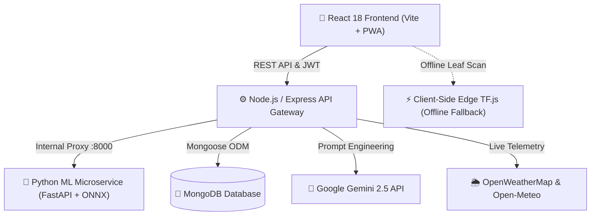

<div align="center">

# 🌾 AgriGrow
### AI-Powered Plant Disease Detection & Precision Agriculture Platform

[](LICENSE)
[](https://nodejs.org/)
[](https://react.dev/)
[](https://vitejs.dev/)
[](https://expressjs.com/)
[](https://www.mongodb.com/)
[](https://fastapi.tiangolo.com/)
[](https://onnxruntime.ai/)
[](https://www.tensorflow.org/js)
[](https://ai.google.dev/)
[](https://web.dev/progressive-web-apps/)

<p align="center">
  A state-of-the-art agricultural web application empowering farmers and agronomists with <strong>dual-engine crop disease diagnosis</strong>, <strong>interactive geospatial land mapping</strong>, <strong>live resilient weather telemetry</strong>, and <strong>generative AI agronomic advisory</strong>.
</p>

[✨ Key Features](#-key-features) •
[🏛️ Architecture](#-system-architecture) •
[🚀 Quick Start](#-quick-start) •
[📡 API Reference](#-api-endpoints) •
[📁 Project Structure](#-project-structure) •
[🌿 Contributing](#-contributing)

---

</div>

## 🌟 Key Features

### 🔬 1. Dual-Engine Disease Diagnosis (Online & Offline)
- **Cloud Microservice**: High-precision MobileNetV2 ONNX model (47 plant disease classes) served via FastAPI.
- **Offline Edge Mode**: Fully functional offline diagnosis directly in the browser via client-side **TensorFlow.js**, enabling field diagnosis in remote rural locations without internet connectivity.
- **Instant Confidence Scores & Remediation**: Detailed treatment recommendations (organic remedies, chemical options, prevention strategies).

### 🗺️ 2. Precision Geospatial Farm Mapping & Land Telemetry
- **Interactive Satellite GIS**: High-resolution satellite and hybrid mapping powered by Leaflet.
- **Polygon Boundary Outlining**: Draw custom farmland boundaries with real-time spherical excess area calculation (acres / hectares / sq ft).
- **Persistent Land Parcels**: Save, inspect, and manage multiple fields with automatic boundary loading and telemetry sync.
- **Live Agro-Telemetry**: Automatic coordinate-based weather telemetry, elevation, soil classification, and irrigation source profiling.

### 🌦️ 3. Resilient Multi-Provider Weather Engine
- **Dual-Layer Weather Integration**: Primary live weather via **OpenWeatherMap** with an automatic, instant fallback to **Open-Meteo**.
- **Agro-Meteorological Forecasts**: 5-day detailed atmospheric forecast (temperature, humidity, precipitation probability, wind speed).
- **Agricultural Season Detection**: Dynamic recognition of cropping seasons (Rabi & Kharif) tailored for South Asian agricultural zones.

### 🤖 4. Generative AI Agronomic Advisory
- Powered by **Google Gemini 2.5 Flash**, delivering context-aware farming advisory.
- Interactive AI modules for **crop suitability ranking**, **disease prevention planning**, and **custom soil management**.

### 📈 5. Real-Time Mandi Market Prices
- Daily tracked commodity price tracking across regional agricultural mandis.
- Visual price trends and market price analytics to help farmers optimize harvest timing.

### 📅 6. Dynamic Crop Cultivation Calendar
- Comprehensive task scheduler from sowing through vegetative, flowering, and harvesting phases.
- AI-driven cultivation schedule generator tailored to specific crop varieties and planting dates.

### 🌐 7. Progressive Web App (PWA) & Multilingual Support
- Installable on mobile (Android/iOS) and desktop platforms with offline caching.
- Native localization for **English**, **Urdu (اردو)**, and **Punjabi (پنجابی)**.

---

## 🏛️ System Architecture



---

## 🚀 Quick Start

### Prerequisites

| Component | Minimum Version | Purpose |
| :--- | :--- | :--- |
| **Node.js** | `>= 18.0.0` | Frontend and Backend runtime |
| **MongoDB** | `>= 6.0` | Primary document database |
| **Python** | `>= 3.10` | (Optional) Cloud ML microservice |
| **npm** | `>= 9.0.0` | Package manager |

---

### 1. Clone the Repository
```bash
git clone https://github.com/husnainshafiq-dev/AgriGrow-A-plant-management-and-disease-detection-system.git
cd AgriGrow-A-plant-management-and-disease-detection-system
```

### 2. Install Dependencies
```bash
# Install root orchestration tools, then client & server packages
npm install
npm run install-all
```

### 3. Environment Configuration
Create environment files from the provided templates:

```bash
# Server configuration
cp server/.env.example server/.env

# Client configuration
cp client/.env.example client/.env
```

Key environment variables in `server/.env`:
```env
PORT=5000
NODE_ENV=development
MONGO_URI=mongodb://127.0.0.1:27017/agrigrow
JWT_SECRET=your_secure_jwt_secret_here

# AI & Weather APIs (optional for demo, recommended for production)
GEMINI_API_KEY=your_gemini_api_key
OPENWEATHER_API_KEY=your_openweather_api_key
ML_SERVICE_URL=http://localhost:8000
```

### 4. Seed Initial Data (Optional)
```bash
npm run seed
```

### 5. Launch the Application
```bash
# Run Backend API (port 5000) and Frontend Client (port 3000) concurrently
npm run dev

# Or run with the Python ML service included
npm run dev:full
```

Open your browser at **`http://localhost:3000`** to access AgriGrow.

---

## 📡 API Endpoints

### 🔐 Authentication (`/api/auth`)
| Method | Route | Description | Access |
| :---: | :--- | :--- | :---: |
| `POST` | `/api/auth/register` | Register new user account | Public |
| `POST` | `/api/auth/login` | Authenticate user & issue JWT | Public |
| `GET` | `/api/auth/me` | Fetch authenticated user profile | Private |

### 🗺️ Precision Dashboard & Land (`/api/dashboard`)
| Method | Route | Description | Access |
| :---: | :--- | :--- | :---: |
| `GET` | `/api/dashboard/weather` | Live coordinate-based weather telemetry | Public |
| `GET` | `/api/dashboard/fields` | List user's saved farm parcels | Private |
| `POST` | `/api/dashboard/fields` | Save polygon boundary & metadata | Private |
| `DELETE` | `/api/dashboard/fields/:id`| Delete saved farm boundary | Private |

### 🦠 Disease Diagnosis (`/api/disease`)
| Method | Route | Description | Access |
| :---: | :--- | :--- | :---: |
| `POST` | `/api/disease/detect` | Upload leaf photo for diagnosis | Public / Private |
| `GET` | `/api/disease/history` | User diagnostic scan history | Private |
| `GET` | `/api/disease/stats` | Aggregated disease occurrence stats | Private |
| `GET` | `/api/disease/ml-health` | Python ML microservice health check | Public |

### 🤖 AI Agronomic Advisory (`/api/advisory` & `/api/suitability`)
| Method | Route | Description | Access |
| :---: | :--- | :--- | :---: |
| `POST` | `/api/advisory/ask` | Ask Gemini farming advisory question | Private |
| `POST` | `/api/suitability/rank`| Rank optimal crops for soil & climate | Private |
| `GET` | `/api/advisory/history`| View past advisory consults | Private |

### 📈 Market Rates & Community (`/api/market`, `/api/calendar`, `/api/forum`)
| Method | Route | Description | Access |
| :---: | :--- | :--- | :---: |
| `GET` | `/api/market/prices` | Mandi commodity rates list | Public |
| `GET` | `/api/calendar` | User crop cultivation task schedule | Private |
| `POST` | `/api/calendar/generate`| Generate AI task calendar for crop | Private |
| `GET` | `/api/forum/threads` | Community forum discussions | Public |

---

## 📁 Project Structure

```
├── client/                     # React 18 Frontend Application (Vite + PWA)
│   ├── public/                 # Static assets, PWA manifests & offline TF.js model
│   └── src/
│       ├── components/         # Reusable UI widgets (Navbar, Footer, Charts, Modals)
│       ├── context/            # Global state (Auth, Bookmarks, Language)
│       ├── i18n/               # Localization strings (EN, UR, PA)
│       ├── pages/              # Main application views (Dashboard, Market, QA, Admin)
│       ├── Dashboard.jsx       # Precision Agriculture Geospatial Map & Control Panel
│       └── offlineModel.js     # Edge in-browser TensorFlow.js inference engine
├── server/                     # Node.js / Express Backend REST API
│   ├── config/                 # Database, CORS & Environment configuration
│   ├── controllers/            # Route business logic handlers
│   ├── middleware/             # JWT Auth, Joi Validation, Error handling, Multer
│   ├── models/                 # Mongoose schemas (User, GeoField, Disease, Crop)
│   ├── routes/                 # Express API router declarations
│   ├── services/               # Gemini AI, Weather, Scrapers & ML clients
│   └── server.js               # Express application entrypoint
├── ml-service/                 # Python FastAPI Microservice
│   ├── models/                 # MobileNetV2 ONNX model files
│   ├── app.py                  # FastAPI inference endpoints
│   └── requirements.txt        # Python ML dependencies
├── scripts/                    # Training and dataset utility scripts
├── .github/                    # CI/CD workflows and issue templates
├── .gitignore                  # Git ignore rules
├── .gitattributes             # Line ending normalization rules
├── LICENSE                     # MIT License
└── package.json                # Project-wide runner orchestration
```

---

## 🧪 Testing

```bash
# Run frontend production build test
cd client && npm run build

# Run backend test suite
cd ../server && npm test
```

---

## 🌿 Contributing

Contributions, bug reports, and suggestions are welcome! Please check our [CONTRIBUTING.md](CONTRIBUTING.md) guide before submitting pull requests.

---

## 📄 License

This project is licensed under the **MIT License** — see the [LICENSE](LICENSE) file for details.
